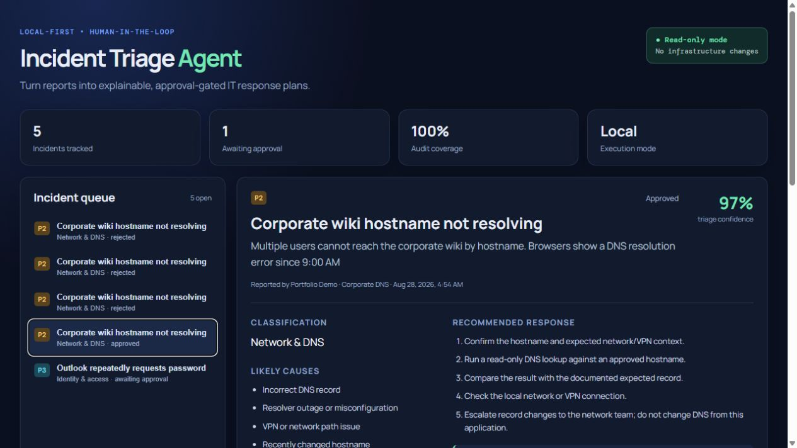
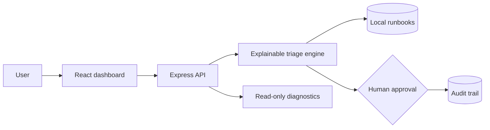

# IT Incident Triage Agent



> A local-first, human-approved IT incident triage agent. It turns incident reports into explainable classifications, runbook-backed response plans, and safe diagnostic results—without changing infrastructure.

## Why this project

Modern developer tooling increasingly combines AI-style agents, structured tool use, observability, and human review. This project applies those ideas to a credible IT operations workflow instead of building another generic chatbot.

The MVP uses a deterministic local triage engine rather than an external LLM. That keeps it easy to run, test, and explain. The architecture makes a future model integration possible while keeping the approval and security boundaries intact.

## Features

- Incident form and JSON API
- Explainable category, priority (P1–P4), likely-cause, and confidence classification
- Local knowledge-base/runbook retrieval with sample data
- Human approval or rejection before any proposed response
- Timeline and local audit records
- Safe, read-only DNS, HTTPS-status, and TCP-port diagnostics
- Responsive React dashboard, Docker, CI, and unit tests

## Architecture



See [the full architecture and trust boundaries](docs/architecture.md).

## Stack choice

| Layer | Choice | Why |
| --- | --- | --- |
| UI | React + TypeScript + Vite | Widely used, modern, fast to learn, and easy to demo. |
| API | Express + TypeScript | A small, readable API layer with a huge learning ecosystem. |
| Data | Local JSON | Zero setup for the portfolio demo; replaceable by a database later. |
| Tests | Vitest | Fast TypeScript tests with a simple API. |
| Packaging | Docker | Repeatable local deployment without cloud infrastructure. |

## Quick start

Prerequisites: Node.js 22+ and npm.

```bash
npm install
npm run dev
```

Open `http://localhost:5173`. The API runs at `http://localhost:3001`.

```bash
npm test
npm run lint
npm run build
```

For a production-style local container:

```bash
docker compose up --build
```

Open `http://localhost:3001`.

## API examples

Create an incident:

```bash
curl -X POST http://localhost:3001/api/incidents -H "Content-Type: application/json" -d '{"title":"VPN login fails","description":"Multiple users cannot access the internal wiki after MFA.","reporter":"Taylor","affectedService":"Corporate VPN"}'
```

The response includes `category`, `priority`, `confidence`, `matchedRunbooks`, `recommendation`, `timeline`, and `auditTrail`.

Record a human decision:

```bash
curl -X POST http://localhost:3001/api/incidents/INCIDENT_ID/decision -H "Content-Type: application/json" -d '{"decision":"approve","reviewer":"On-call engineer"}'
```

Safe diagnostics are available at `POST /api/diagnostics/dns`, `/http`, and `/port`. The dashboard uses only demonstration hosts; blocked requests return JSON with `status: "blocked"`.

## Security and safety

- Default data is local sample data—there are no credentials, cloud resources, or live IT integrations.
- Diagnostics are read-only and constrained to a small allowlist (`localhost`, `example.com`, `example.org`, `httpbin.org`) and select ports.
- HTTP checks require HTTPS, use `HEAD`, enforce a five-second timeout, and do not follow redirects.
- Approval records a decision; it does not execute a remediation action.
- Do not add internal hostnames, tokens, employee data, or production credentials to a public repository.

## Project structure

`client/` is the dashboard. `server/` contains the API, triage engine, diagnostics, and local storage. `shared/` contains domain types. `data/` includes sample incidents and runbooks. `tests/` holds unit tests. `docs/` contains architecture and a screenshot placeholder.

## Roadmap

- [ ] Add SQLite/PostgreSQL persistence and user authentication
- [ ] Add OpenTelemetry traces, metrics, and evaluation datasets
- [ ] Integrate a governed LLM/RAG provider behind the same structured contract
- [ ] Add role-based reviewer permissions and tamper-evident audit storage
- [ ] Extract safe tools as an MCP IT operations server
- [ ] Add an optional sandboxed device-inventory connector

## Resume-ready description

> Built a local-first IT Incident Triage Agent using React, TypeScript, and Express. Designed an explainable runbook-retrieval workflow that classifies incidents by category and priority, generates confidence-scored response plans, records a complete audit timeline, and requires human approval before any action. Added guardrailed, read-only DNS/HTTP/TCP diagnostics, automated tests, Docker packaging, and CI.

## Demo talking points

1. Submit an Outlook, VPN, DNS, or web-service issue and show the runbook match.
2. Explain why the confidence score and priority are transparent, not a black box.
3. Approve or reject the plan and show the timeline entry.
4. Run a diagnostic, then demonstrate a blocked non-allowlisted request through the API.
