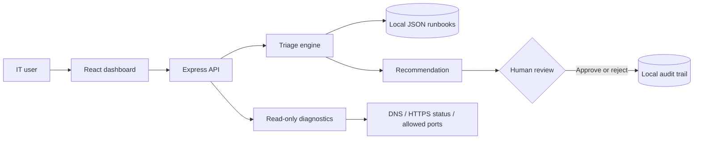

# Architecture

The triage engine is deterministic and explainable by design. It scores keywords against local runbooks, selects a category and priority, and returns the matching evidence. Replacing the engine with an LLM later must preserve the same approval gate and structured response contract.

## Trust boundaries

- Browser input is validated by the API before a record is created.
- The diagnostics route only accepts explicitly allowlisted demonstration hosts and ports.
- HTTP diagnostics permit HTTPS and use `HEAD` with a five-second timeout.
- The app never stores secrets and includes no write-capable infrastructure connector.
- Approvals record a decision only; they do not execute remediation.
